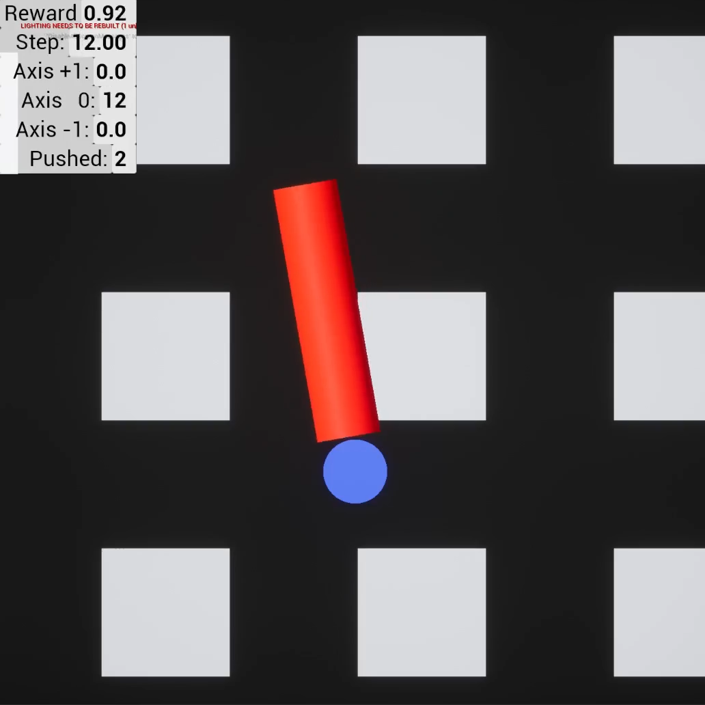

Cartpole
========

Reimplementation of the cartpole environment in UE4 as a demo of the UE4ML plugin

Requirements
~~~~~~~~~~~~

* UE4 - 4.27/master

.. note::

   For linux you will need to compile my `custom branch <https://github.com/EpicGames/UnrealEngine/pull/8745>`_ from source.

Install
~~~~~~~

Install the python package to run this example as a gym environment

.. code-block:: bash

   pip install -e .

To run the example just launch the appropriate script

.. code-block:: bash

   python Source/python/cartpole/run.py --project E:/cartpole/Cartpole.uproject --exec E:/UnrealEngine/Engine/Binaries/Win64/UE4Editor.exe

.. raw:: html

   <iframe width="100%" height="315" src="https://www.youtube-nocookie.com/embed/dV_mkHu1wQ4" title="YouTube video player" frameborder="0" allow="accelerometer; autoplay; clipboard-write; encrypted-media; gyroscope; picture-in-picture" allowfullscreen></iframe>

